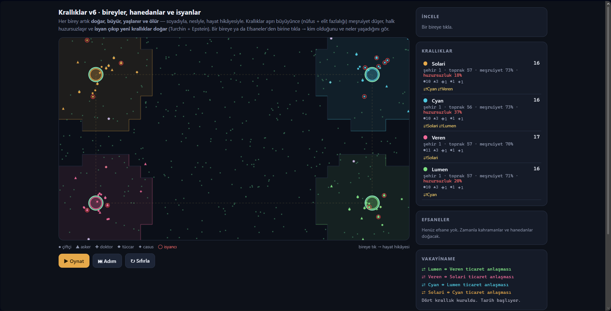
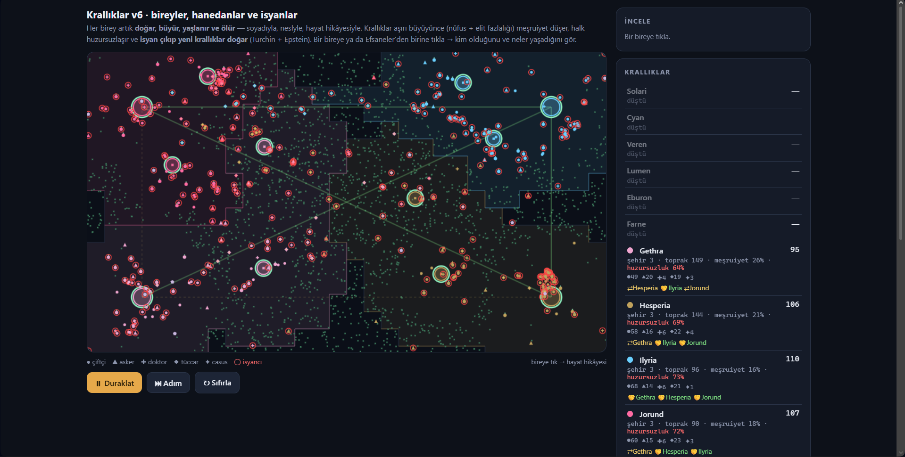
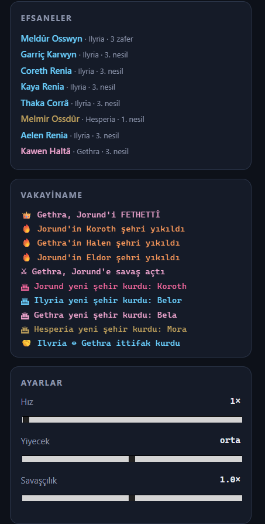

<div align="center">

# 🌍 Agent-Based Civilization Simulation

### An emergent civilization simulation where autonomous AI agents build kingdoms, wage wars, establish dynasties and create unique histories.

[](https://developer.mozilla.org/en-US/docs/Web/JavaScript)
[](https://developer.mozilla.org/en-US/docs/Web/HTML)
[](LICENSE)

### ▶️ Live Demo

**https://acarbayk.github.io/agent-based-civilization-simulation/**

</div>

---

# 📖 About

This project explores **emergent behaviour** through autonomous AI agents.

Instead of scripting historical events, every individual acts independently and interacts with the world according to its own goals and circumstances.

Kingdoms emerge naturally, expand across the map, negotiate alliances, wage wars, establish cities, create dynasties and sometimes collapse into rebellions.

No two simulations are exactly alike.

---

# ✨ Features

## 🤖 Autonomous AI

Every individual exists as an independent agent capable of making its own decisions.

Agents can:

- 🌾 Gather food
- ⚔️ Fight enemies
- 🩺 Heal allies
- 💰 Trade
- 🕵️ Spy
- 👶 Be born
- 👴 Age
- ☠️ Die
- 👑 Become legendary figures

---

## 🏰 Kingdom Simulation

Each kingdom continuously evaluates its situation and reacts dynamically.

Kingdoms can:

- Expand territory
- Found cities
- Form alliances
- Declare wars
- Sign peace treaties
- Manage legitimacy
- Suppress unrest
- Collapse through rebellion

---

## 🌍 World Simulation

The world continuously evolves through interactions between autonomous systems.

Included systems:

- Territory Expansion
- Diplomacy
- Warfare
- Reputation
- Cities
- Dynasties
- Legends
- Rebellions
- Procedural History

---

# 📸 Screenshots

## Early Simulation



---

## Late Game



---

## Legends & History



---

# 🧠 Simulation Architecture

```
Individuals
      │
      ▼
Decision Making
      │
      ▼
Role Behaviour
      │
      ▼
Kingdom Systems
      │
 ├─ Diplomacy
 ├─ Warfare
 ├─ Expansion
 ├─ Cities
 ├─ Dynasties
 └─ Rebellions
      │
      ▼
Emergent History
```

---

# 🚀 Evolution

| Version | Major Addition |
|----------|----------------|
| v1 | Basic civilization simulation |
| v2 | Named individuals & technology |
| v3 | Utility AI & specialized roles |
| v4 | Diplomacy, trade & espionage |
| v5 | Reputation, alliances & cities |
| v6 | Dynasties, legends & rebellions |

---

# 🛠 Technologies

- HTML5
- CSS3
- Vanilla JavaScript
- HTML5 Canvas

No external frameworks or libraries were used.

---

# 🎯 Goals

This project was created to explore how relatively simple AI rules can generate complex civilizations and believable historical narratives without predefined scripts.

Every simulation tells a different story driven entirely by interactions between autonomous agents.

---

# 🔮 Future Plans

- Religion
- Economy
- Cultural evolution
- Climate simulation
- Natural disasters
- More advanced AI personalities
- Save / Load system
- World generation

---

# ▶️ Running

Clone the repository

```bash
git clone https://github.com/acarbayk/agent-based-civilization-simulation.git
```

Open

```text
index.html
```

using any modern web browser.

No installation is required.

---

# 📄 License

This project is licensed under the MIT License.
